# 🏢 **PÉRIMÈTRE FONCTIONNEL - API Backend de Gestion de Rendez-vous**

## 🎯 **Vision Métier**

**API Backend Enterprise** complète pour la gestion intelligente des rendez-vous, permettant aux entreprises de **paramétrer leur système calendaire**, **intégrer leur personnel**, et offrir une **expérience client optimale** avec notifications multi-canaux (email/SMS).

## 🏗️ **Architecture Séparée Frontend/Backend**

### 🎨 **Frontend Next.js** (Application Séparée)
- **Site web public** optimisé pour le **référencement SEO**
- **Interface internautes** pour la prise de rendez-vous en ligne
- **Pages statiques générées** pour performances maximales
- **Responsive design** mobile-first
- **Optimisation Core Web Vitals** pour Google
- **Intégration Google Analytics/Tag Manager**
- **Schema.org markup** pour rich snippets
- **Sitemap XML automatique** et robots.txt optimisés

### 🚀 **Backend NestJS** (Ce Projet)
- **API REST pure** avec endpoints sécurisés
- **Gestion métier complète** des rendez-vous
- **Authentification entreprise** et personnel
- **Intégrations tierces** (email, SMS, calendriers)
- **Dashboard administrateur** via API
- **Webhooks** pour synchronisation temps réel
- **Rate limiting** et sécurité enterprise

---

## 🏛️ **Domaines Métier**

### 🏢 **1. Gestion d'Entreprise**

- **Configuration système calendaire**
- **Paramétrage des horaires d'ouverture**
- **Gestion multi-site** (si applicable)
- **Configuration des services proposés**
- **Para ├── enums/
  └── repositories/
  ├── business.repository.ts
  ├── business-location.repository.ts # 🔥 NOUVEAU
  ├── staff.repository.ts
  ├── location-assignment.repository.ts # 🔥 NOUVEAU
  ├── facility.repository.ts # 🔥 NOUVEAU
  ├── appointment.repository.ts
  ├── appointment-group.repository.ts  
   ├── service.repository.ts
  ├── capacity-rule.repository.ts  
   └── notification.repository.ts├── appointment-status.enum.ts
  │ ├── staff-role.enum.ts
  │ ├── notification-channel.enum.ts
  │ ├── notification-event-type.enum.ts
  │ ├── relationship-type.enum.ts # 🔥 NOUVEAU
  │ ├── group-type.enum.ts # 🔥 NOUVEAU
  │ ├── capacity-rule-type.enum.ts # 🔥 NOUVEAU
  │ └── user-role.enum.ts (étendu)e des créneaux disponibles**

### 👥 **2. Gestion du Personnel**

- **Intégration des employés** avec rôles spécialisés
- **Planning individuel** et **disponibilités**
- **Compétences et spécialisations**
- **Gestion des congés et absences**
- **Notifications internes**

### 📅 **3. Système de Rendez-vous**

- **Prise de rendez-vous en ligne** par les clients
- **Validation et confirmation** automatique/manuelle
- **Gestion des créneaux** et **évitement des conflits**
- **Reprogrammation et annulation**
- **Historique des rendez-vous**

### 🌐 **4. Interface Client Public (Frontend Next.js Séparé)**

- **Site web Next.js** optimisé SEO avec référencement naturel
- **Pages statiques générées** pour performances maximales
- **Interface responsive** adaptée mobile et desktop
- **Consommation API REST** sécurisée avec cache intelligent
- **Authentification client** optionnelle via tokens JWT
- **Sélection de services** et **créneaux disponibles** temps réel
- **Informations client** et **préférences** persistées

### 📧 **5. Communication Multi-canaux**

- **Notifications email** automatisées
- **Notifications SMS** (intégration à prévoir)
- **Rappels personnalisables** (J-1, H-2, etc.)
- **Confirmations** et **modifications**

---

## 🎭 **Types d'Utilisateurs**

### 🔴 **1. SUPER_ADMIN** - Propriétaire/Directeur

**Responsabilités :**

- Configuration globale du système calendaire
- Gestion des paramètres d'entreprise
- Supervision de tous les services et personnel
- Accès aux rapports et analyses complètes
- Configuration des notifications et communications

**Permissions étendues :**

```typescript
enum SuperAdminPermission {
  // Configuration Système
  CONFIGURE_BUSINESS_SETTINGS = 'CONFIGURE_BUSINESS_SETTINGS',
  MANAGE_CALENDAR_CONFIG = 'MANAGE_CALENDAR_CONFIG',
  MANAGE_SERVICE_CATALOG = 'MANAGE_SERVICE_CATALOG',
  MANAGE_CAPACITY_RULES = 'MANAGE_CAPACITY_RULES', // 🔥 NOUVEAU

  // Personnel
  MANAGE_ALL_STAFF = 'MANAGE_ALL_STAFF',
  VIEW_ALL_SCHEDULES = 'VIEW_ALL_SCHEDULES',

  // Rendez-vous
  VIEW_ALL_APPOINTMENTS = 'VIEW_ALL_APPOINTMENTS',
  MODIFY_ANY_APPOINTMENT = 'MODIFY_ANY_APPOINTMENT',
  MANAGE_GROUP_BOOKINGS = 'MANAGE_GROUP_BOOKINGS', // 🔥 NOUVEAU
  OVERRIDE_CAPACITY_LIMITS = 'OVERRIDE_CAPACITY_LIMITS', // 🔥 NOUVEAU

  // Réservations Tiers
  VALIDATE_THIRD_PARTY_BOOKINGS = 'VALIDATE_THIRD_PARTY_BOOKINGS', // 🔥 NOUVEAU
  MANAGE_CONSENT_DOCUMENTS = 'MANAGE_CONSENT_DOCUMENTS', // 🔥 NOUVEAU

  // Analytics
  VIEW_BUSINESS_ANALYTICS = 'VIEW_BUSINESS_ANALYTICS',
  VIEW_CAPACITY_ANALYTICS = 'VIEW_CAPACITY_ANALYTICS', // 🔥 NOUVEAU
  EXPORT_DATA = 'EXPORT_DATA',
}
```

### 🟡 **2. MANAGER** - Chef d'équipe/Responsable

**Responsabilités :**

- Gestion de son équipe de personnel
- Validation des rendez-vous de son secteur
- Gestion des plannings de son équipe
- Suivi des performances de son secteur

**Permissions :**

```typescript
enum ManagerPermission {
  // Équipe
  MANAGE_TEAM_STAFF = 'MANAGE_TEAM_STAFF',
  VIEW_TEAM_SCHEDULES = 'VIEW_TEAM_SCHEDULES',
  APPROVE_LEAVE_REQUESTS = 'APPROVE_LEAVE_REQUESTS',

  // Rendez-vous
  VIEW_TEAM_APPOINTMENTS = 'VIEW_TEAM_APPOINTMENTS',
  VALIDATE_APPOINTMENTS = 'VALIDATE_APPOINTMENTS',
  RESCHEDULE_APPOINTMENTS = 'RESCHEDULE_APPOINTMENTS',

  // Rapports
  VIEW_TEAM_REPORTS = 'VIEW_TEAM_REPORTS',
}
```

### 🟢 **3. STAFF** - Personnel/Employé

**Responsabilités :**

- Gestion de son planning personnel
- Prise en charge de ses rendez-vous
- Mise à jour de ses disponibilités
- Communication avec les clients

**Permissions :**

```typescript
enum StaffPermission {
  // Planning personnel
  MANAGE_OWN_SCHEDULE = 'MANAGE_OWN_SCHEDULE',
  SET_AVAILABILITY = 'SET_AVAILABILITY',
  REQUEST_LEAVE = 'REQUEST_LEAVE',

  // Rendez-vous assignés
  VIEW_OWN_APPOINTMENTS = 'VIEW_OWN_APPOINTMENTS',
  CONFIRM_APPOINTMENTS = 'CONFIRM_APPOINTMENTS',
  ADD_APPOINTMENT_NOTES = 'ADD_APPOINTMENT_NOTES',

  // Client
  VIEW_CLIENT_INFO = 'VIEW_CLIENT_INFO',
  COMMUNICATE_WITH_CLIENTS = 'COMMUNICATE_WITH_CLIENTS',
}
```

### 🔵 **4. CLIENT** - Client enregistré

**Responsabilités :**

- Prise de rendez-vous en ligne
- Gestion de ses informations personnelles
- Consultation de son historique
- Réception des notifications

**Permissions :**

```typescript
enum ClientPermission {
  // Rendez-vous personnels
  BOOK_APPOINTMENT = 'BOOK_APPOINTMENT',
  VIEW_OWN_APPOINTMENTS = 'VIEW_OWN_APPOINTMENTS',
  CANCEL_OWN_APPOINTMENTS = 'CANCEL_OWN_APPOINTMENTS',
  RESCHEDULE_OWN_APPOINTMENTS = 'RESCHEDULE_OWN_APPOINTMENTS',

  // Réservations pour tiers 🔥 NOUVEAU
  BOOK_FOR_FAMILY_MEMBER = 'BOOK_FOR_FAMILY_MEMBER',
  BOOK_FOR_CHILD = 'BOOK_FOR_CHILD',
  BOOK_FOR_SPOUSE = 'BOOK_FOR_SPOUSE',
  BOOK_FOR_PARENT = 'BOOK_FOR_PARENT',
  MANAGE_FAMILY_APPOINTMENTS = 'MANAGE_FAMILY_APPOINTMENTS',

  // Réservations de groupe 🔥 NOUVEAU
  BOOK_GROUP_APPOINTMENTS = 'BOOK_GROUP_APPOINTMENTS',
  MANAGE_GROUP_BOOKINGS = 'MANAGE_GROUP_BOOKINGS',

  // Profil
  MANAGE_OWN_PROFILE = 'MANAGE_OWN_PROFILE',
  MANAGE_FAMILY_PROFILES = 'MANAGE_FAMILY_PROFILES', // 🔥 NOUVEAU
  VIEW_APPOINTMENT_HISTORY = 'VIEW_APPOINTMENT_HISTORY',
  SET_NOTIFICATION_PREFERENCES = 'SET_NOTIFICATION_PREFERENCES',

  // Consentements 🔥 NOUVEAU
  GIVE_PARENTAL_CONSENT = 'GIVE_PARENTAL_CONSENT',
  MANAGE_CONSENT_DOCUMENTS = 'MANAGE_CONSENT_DOCUMENTS',
}
```

### ⚪ **5. GUEST** - Internaute non inscrit

**Responsabilités :**

- Consultation des créneaux disponibles
- Prise de rendez-vous ponctuelle
- Réception des notifications de base

**Permissions :**

```typescript
enum GuestPermission {
  VIEW_AVAILABLE_SLOTS = 'VIEW_AVAILABLE_SLOTS',
  BOOK_GUEST_APPOINTMENT = 'BOOK_GUEST_APPOINTMENT',
  VIEW_PUBLIC_SERVICES = 'VIEW_PUBLIC_SERVICES',
}
```

---

## 🏗️ **Spécifications Techniques Frontend/Backend**

### 🎨 **Frontend Next.js - Site Web Public**

#### **🚀 Optimisations SEO & Performances**

```typescript
// Configuration Next.js optimisée
export default {
  // Static Generation pour SEO optimal
  output: 'export', // Pages statiques générées
  trailingSlash: true,
  
  // Core Web Vitals optimisés
  images: {
    formats: ['image/webp', 'image/avif'],
    loader: 'custom',
    domains: ['api.votre-domaine.com']
  },
  
  // Métadonnées SEO dynamiques
  generateMetadata: async ({ params }) => ({
    title: `Prendre RDV - ${business.name} - ${location.name}`,
    description: `Réservez en ligne votre rendez-vous chez ${business.name}. Créneaux disponibles, confirmation immédiate.`,
    keywords: ['rendez-vous', business.name, location.city, ...services],
    openGraph: {
      type: 'website',
      locale: 'fr_FR',
      url: `https://rdv.${business.domain}/${location.slug}`,
      siteName: business.name,
      images: [{
        url: business.logoUrl,
        width: 1200,
        height: 630,
        alt: `${business.name} - Prise de rendez-vous`
      }]
    },
    robots: {
      index: true,
      follow: true,
      googleBot: {
        index: true,
        follow: true,
        'max-video-preview': -1,
        'max-image-preview': 'large',
        'max-snippet': -1
      }
    }
  })
}
```

#### **🔍 Schema.org pour Rich Snippets**

```typescript
// JSON-LD pour Google Rich Results
const businessSchema = {
  "@context": "https://schema.org",
  "@type": "LocalBusiness",
  "name": business.name,
  "description": business.description,
  "url": `https://rdv.${business.domain}`,
  "telephone": business.phone,
  "address": {
    "@type": "PostalAddress",
    "streetAddress": location.address.street,
    "addressLocality": location.address.city,
    "postalCode": location.address.zipCode,
    "addressCountry": "FR"
  },
  "geo": {
    "@type": "GeoCoordinates",
    "latitude": location.coordinates.lat,
    "longitude": location.coordinates.lng
  },
  "openingHours": location.businessHours.map(schedule => 
    `${schedule.dayOfWeek} ${schedule.openTime}-${schedule.closeTime}`
  ),
  "hasOfferCatalog": {
    "@type": "OfferCatalog",
    "name": "Services disponibles",
    "itemListElement": services.map(service => ({
      "@type": "Offer",
      "itemOffered": {
        "@type": "Service",
        "name": service.name,
        "description": service.description,
        "provider": business.name
      }
    }))
  }
}
```

#### **📱 Architecture Frontend - Pages Principales**

```typescript
// Structure pages Next.js optimisée SEO
app/
├── layout.tsx                    # Layout global avec GA4
├── page.tsx                      # Landing page entreprise
├── [location]/                   # Pages par site/adresse
│   ├── page.tsx                  # Page site spécifique
│   ├── services/page.tsx         # Liste services du site
│   ├── rdv/                      # Tunnel de réservation
│   │   ├── page.tsx              # Sélection service + créneau
│   │   ├── client/page.tsx       # Infos client
│   │   ├── tiers/page.tsx        # Réservation pour proche
│   │   └── confirmation/page.tsx # Validation réservation
│   └── suivi/                    # Gestion RDV client
│       ├── [token]/page.tsx      # Détails RDV public
│       ├── modifier/page.tsx     # Modification RDV
│       └── annuler/page.tsx      # Annulation RDV
├── sitemap.xml                   # Sitemap automatique
├── robots.txt                    # Robots optimisé
└── api/                          # Routes API internes
    ├── revalidate/               # ISR revalidation
    └── webhook/                  # Webhooks NestJS
```

### 🚀 **Backend NestJS - API Enterprise**

#### **🌐 Endpoints API pour Frontend**

```typescript
// API publique consommée par Next.js
@Controller('public')
export class PublicAppointmentController {
  
  // Données SEO-friendly avec cache
  @Get('businesses')
  @CacheControl(300) // 5min cache
  async getBusinesses(): Promise<PublicBusinessDto[]> {
    // Données optimisées pour SEO + performance
  }
  
  @Get('businesses/:id/locations')
  @CacheControl(300)
  async getBusinessLocations(
    @Param('id') businessId: string
  ): Promise<PublicLocationDto[]> {
    // Sites avec données SEO (coordonnées, horaires, etc.)
  }
  
  @Get('availability')
  @CacheControl(60) // 1min cache - données temps réel
  async getAvailability(
    @Query() filters: AvailabilityFiltersDto
  ): Promise<AvailabilityResponseDto> {
    // Créneaux disponibles optimisés
  }
  
  // Réservation avec validation complète
  @Post('appointments')
  @RateLimit({ ttl: 60, limit: 10 }) // Protection spam
  async createAppointment(
    @Body() data: CreatePublicAppointmentDto
  ): Promise<PublicAppointmentResponseDto> {
    // Création avec token public pour suivi
  }
  
  // Gestion RDV client via token public
  @Get('appointments/:token')
  async getAppointmentByToken(
    @Param('token') token: string
  ): Promise<PublicAppointmentDto> {
    // Accès sécurisé sans auth
  }
}
```

#### **🔄 Synchronisation Temps Réel**

```typescript
// Webhooks pour synchronisation Frontend
@Controller('webhooks')
export class WebhookController {
  
  @Post('appointment-created')
  async onAppointmentCreated(@Body() data: AppointmentCreatedEvent) {
    // Revalidation ISR Next.js
    await this.nextjsService.revalidate([
      `/api/revalidate?path=/${data.location.slug}`,
      `/api/revalidate?path=/${data.location.slug}/rdv`
    ]);
    
    // Notification temps réel clients connectés
    await this.websocketService.emit('availability-updated', {
      locationId: data.locationId,
      serviceId: data.serviceId,
      date: data.appointmentDate
    });
  }
  
  @Post('business-updated')
  async onBusinessUpdated(@Body() data: BusinessUpdatedEvent) {
    // Mise à jour cache + revalidation pages
    await this.cacheService.invalidate(`business:${data.businessId}:*`);
    await this.nextjsService.revalidateAll();
  }
}
```

#### **📊 Analytics & SEO Data**

```typescript
// Données analytics pour optimisation SEO
@Controller('admin/seo')
export class SeoAnalyticsController {
  
  @Get('performance')
  async getSeoPerformance(): Promise<SeoMetricsDto> {
    return {
      // Core Web Vitals depuis Real User Monitoring
      coreWebVitals: await this.analyticsService.getCoreWebVitals(),
      
      // Positions mots-clés
      keywordRankings: await this.seoService.getKeywordRankings(),
      
      // Trafic organique
      organicTraffic: await this.analyticsService.getOrganicTraffic(),
      
      // Taux conversion par landing page
      conversionRates: await this.analyticsService.getConversionRates()
    };
  }
  
  @Get('content-optimization')
  async getContentSuggestions(): Promise<ContentOptimizationDto> {
    // Suggestions auto d'optimisation contenu
    return await this.aiService.generateSeoSuggestions({
      businessType: this.business.category,
      location: this.business.locations,
      competitors: await this.seoService.getCompetitors()
    });
  }
}
```

---

## 🏗️ **Entités Métier Principales**

### 🏢 **Business (Entreprise)**

```typescript
export class Business {
  public readonly id: string;
  public readonly name: string;
  public readonly description?: string;
  public readonly headquarters: Address; // 🔥 MODIFIÉ: Siège social
  public readonly locations: BusinessLocation[]; // 🔥 NOUVEAU: Sites multiples
  public readonly contactInfo: ContactInfo;
  public readonly globalSettings: BusinessSettings;
  public readonly createdAt: Date;
  public readonly updatedAt: Date;

  // Factory methods
  static create(data: CreateBusinessData): Business;

  // Business rules
  getAllServices(): Service[]; // 🔥 NOUVEAU: Services de tous les sites
  getLocationById(locationId: string): BusinessLocation | null; // 🔥 NOUVEAU
  canOfferServiceAtLocation(serviceId: string, locationId: string): boolean; // 🔥 NOUVEAU
  getAvailableStaffAtLocation(
    locationId: string,
    service: Service,
    dateTime: Date,
  ): Staff[]; // 🔥 NOUVEAU
  hasMultipleLocations(): boolean; // 🔥 NOUVEAU
}
```

### 🏪 **BusinessLocation (Site/Adresse)** 🔥 **NOUVEAU**

```typescript
export class BusinessLocation {
  public readonly id: string;
  public readonly businessId: string;
  public readonly name: string; // Ex: "Centre-ville", "Succursale Nord"
  public readonly address: Address;
  public readonly contactInfo: ContactInfo;
  public readonly businessHours: BusinessHours[];
  public readonly services: Service[]; // Services spécifiques à ce site
  public readonly facilities: Facility[]; // Équipements du site
  public readonly capacity: LocationCapacity;
  public readonly isActive: boolean;
  public readonly settings: LocationSettings;
  public readonly createdAt: Date;
  public readonly updatedAt: Date;

  // Business rules
  isOpenAt(dateTime: Date): boolean;
  canOfferService(serviceId: string): boolean;
  getAvailableStaff(service: Service, dateTime: Date): Staff[];
  calculateDistanceFrom(otherLocation: BusinessLocation): number;
  shareStaffWith(otherLocation: BusinessLocation): boolean;
  hasCapacityFor(service: Service, groupSize: number): boolean;
}
```

### 👤 **Staff (Personnel)**

```typescript
export class Staff {
  public readonly id: string;
  public readonly userId: string; // Référence vers User
  public readonly businessId: string;
  public readonly primaryLocationId: string; // 🔥 NOUVEAU: Site principal
  public readonly assignedLocations: LocationAssignment[]; // 🔥 NOUVEAU: Sites assignés
  public readonly role: StaffRole;
  public readonly specializations: Service[];
  public readonly isActive: boolean;
  public readonly hireDate: Date;

  // Business rules
  isAvailableAt(dateTime: Date, locationId?: string): boolean; // 🔥 MODIFIÉ
  canProvideService(serviceId: string, locationId?: string): boolean; // 🔥 MODIFIÉ
  getWorkingHoursForDay(
    day: DayOfWeek,
    locationId: string,
  ): WorkingHours | null; // 🔥 MODIFIÉ
  isAssignedToLocation(locationId: string): boolean; // 🔥 NOUVEAU
  canWorkAtLocation(locationId: string, dateTime: Date): boolean; // 🔥 NOUVEAU
  getTravelTimeBetweenLocations(
    fromLocation: string,
    toLocation: string,
  ): number; // 🔥 NOUVEAU
  getLocationPriority(locationId: string): number; // 🔥 NOUVEAU
}
```

### 📍 **LocationAssignment (Affectation Site)** 🔥 **NOUVEAU**

```typescript
export class LocationAssignment {
  public readonly id: string;
  public readonly staffId: string;
  public readonly locationId: string;
  public readonly workingHours: WorkingHours[];
  public readonly priority: number; // 1=principal, 2=secondaire, etc.
  public readonly maxHoursPerWeek: number;
  public readonly startDate: Date;
  public readonly endDate?: Date;
  public readonly restrictions?: LocationRestriction[];
  public readonly isActive: boolean;

  // Business rules
  isActiveOn(date: Date): boolean;
  canWorkHours(hours: number): boolean;
  getAvailableHoursForWeek(weekStart: Date): number;
  hasRestrictionFor(serviceId: string): boolean;
}
```

### 🏗️ **Facility (Équipement/Salle)** 🔥 **NOUVEAU**

```typescript
export class Facility {
  public readonly id: string;
  public readonly locationId: string;
  public readonly name: string;
  public readonly type: FacilityType;
  public readonly capacity: number;
  public readonly equipment: Equipment[];
  public readonly suitableServices: string[]; // ServiceIds
  public readonly bookingRules: FacilityBookingRule[];
  public readonly isActive: boolean;

  // Business rules
  isAvailableAt(dateTime: Date, duration: number): boolean;
  canAccommodateService(service: Service): boolean;
  calculateOptimalCapacity(service: Service): number;
  hasRequiredEquipment(requirements: EquipmentRequirement[]): boolean;
}
```

### 📅 **Appointment (Rendez-vous)**

```typescript
export class Appointment {
  public readonly id: string;
  public readonly businessId: string;
  public readonly locationId: string; // 🔥 NOUVEAU: Site du RDV
  public readonly serviceId: string;
  public readonly staffId: string;
  public readonly facilityId?: string; // 🔥 NOUVEAU: Salle/Équipement utilisé
  public readonly clientId?: string; // Optional pour les guests
  public readonly bookedBy: ClientInfo; // Qui a réservé
  public readonly beneficiary: BeneficiaryInfo; // Bénéficiaire du RDV
  public readonly relationship?: RelationshipType; // Relation
  public readonly groupSize: number; // Nombre de personnes
  public readonly additionalBeneficiaries?: BeneficiaryInfo[]; // RDV groupe
  public readonly scheduledAt: Date;
  public readonly duration: number; // en minutes
  public readonly status: AppointmentStatus;
  public readonly notes?: string;
  public readonly consentGiven: boolean; // Consentement pour tiers
  public readonly travelTimeBuffer?: number; // 🔥 NOUVEAU: Temps de trajet staff
  public readonly createdAt: Date;
  public readonly updatedAt: Date;

  // Business rules
  canBeRescheduled(): boolean;
  canBeCancelled(): boolean;
  isUpcoming(): boolean;
  requiresConfirmation(): boolean;
  isBookedForSelf(): boolean;
  requiresParentalConsent(): boolean;
  canBookerModify(): boolean;
  getLocation(): BusinessLocation; // 🔥 NOUVEAU
  requiresFacility(): boolean; // 🔥 NOUVEAU
  canStaffTravelInTime(previousAppointment?: Appointment): boolean; // 🔥 NOUVEAU
}
```

### 🛎️ **Service**

```typescript
export class Service {
  public readonly id: string;
  public readonly businessId: string;
  public readonly availableLocations: string[]; // 🔥 NOUVEAU: Sites où le service est disponible
  public readonly name: string;
  public readonly description: string;
  public readonly duration: number; // en minutes
  public readonly price: Money;
  public readonly locationSpecificPricing: Map<string, Money>; // 🔥 NOUVEAU: Prix par site
  public readonly requiresStaffSpecialization: boolean;
  public readonly maxConcurrentCapacity: number;
  public readonly allowsGroupBooking: boolean;
  public readonly maxGroupSize: number;
  public readonly facilityRequirements: FacilityRequirement[]; // 🔥 NOUVEAU
  public readonly isActive: boolean;
  public readonly settings: ServiceSettings;

  // Business rules
  calculateEndTime(startTime: Date): Date;
  isAvailableForBooking(): boolean;
  isAvailableAtLocation(locationId: string): boolean; // 🔥 NOUVEAU
  getQualifiedStaffAtLocation(locationId: string): Staff[]; // 🔥 NOUVEAU
  getPriceForLocation(locationId: string): Money; // 🔥 NOUVEAU
  canAccommodateAdditionalBooking(currentBookings: number): boolean;
  calculateAvailableCapacity(currentBookings: number): number;
  requiresFacilityType(facilityType: FacilityType): boolean; // 🔥 NOUVEAU
}
```

### 🕒 **TimeSlot (Créneau)**

```typescript
export class TimeSlot {
  public readonly startTime: Date;
  public readonly endTime: Date;
  public readonly staffId: string;
  public readonly serviceId: string;
  public readonly currentCapacity: number; // 🔥 NOUVEAU: Capacité utilisée
  public readonly maxCapacity: number; // 🔥 NOUVEAU: Capacité maximale
  public readonly isAvailable: boolean;
  public readonly appointmentIds: string[]; // 🔥 NOUVEAU: Liste des RDV (au lieu d'un seul)

  // Business rules
  overlaps(other: TimeSlot): boolean;
  canAccommodateService(service: Service): boolean;
  canAccommodateAdditionalBooking(groupSize: number): boolean; // 🔥 NOUVEAU
  getRemainingCapacity(): number; // 🔥 NOUVEAU
  getDuration(): number;
  isFull(): boolean; // 🔥 NOUVEAU
}
```

### 📞 **NotificationPreference**

```typescript
export class NotificationPreference {
  public readonly clientId: string;
  public readonly emailEnabled: boolean;
  public readonly smsEnabled: boolean;
  public readonly reminderSettings: ReminderSettings;
  public readonly channels: NotificationChannel[];

  // Business rules
  shouldSendEmail(eventType: NotificationEventType): boolean;
  shouldSendSMS(eventType: NotificationEventType): boolean;
  getReminderTiming(eventType: NotificationEventType): number[];
}
```

### 👥 **BeneficiaryInfo (Bénéficiaire)**

```typescript
export class BeneficiaryInfo {
  public readonly firstName: string;
  public readonly lastName: string;
  public readonly email?: string;
  public readonly phone?: string;
  public readonly dateOfBirth?: Date;
  public readonly gender?: Gender;
  public readonly relationship: RelationshipType;
  public readonly emergencyContact?: ContactInfo;
  public readonly medicalNotes?: string; // Pour certains services
  public readonly preferredLanguage: string;

  // Business rules
  getAge(): number;
  isMinor(): boolean;
  requiresParentalConsent(): boolean;
  canReceiveDirectNotifications(): boolean;
}
```

### 🔗 **AppointmentGroup (Groupe de RDV)**

```typescript
export class AppointmentGroup {
  public readonly id: string;
  public readonly mainAppointmentId: string;
  public readonly groupType: GroupType; // FAMILY, TEAM, COUPLE, etc.
  public readonly appointments: Appointment[];
  public readonly bookedBy: ClientInfo;
  public readonly totalSize: number;
  public readonly discountApplied?: Money;
  public readonly specialRequests?: string;
  public readonly createdAt: Date;

  // Business rules
  calculateTotalPrice(): Money;
  canAllBeCancelledTogether(): boolean;
  requiresGroupConfirmation(): boolean;
  hasMinorBeneficiaries(): boolean;
}
```

### 📊 **CapacityRule (Règle de Capacité)**

```typescript
export class CapacityRule {
  public readonly serviceId: string;
  public readonly timeOfDay: TimeRange;
  public readonly dayOfWeek: DayOfWeek[];
  public readonly maxConcurrentAppointments: number;
  public readonly staffRequirement: StaffRequirement;
  public readonly roomRequirement?: RoomRequirement;
  public readonly isActive: boolean;

  // Business rules
  appliesTo(dateTime: Date): boolean;
  calculateRequiredStaff(currentBookings: number): number;
  canAccommodateBooking(currentLoad: CapacityLoad): boolean;
}
```

---

## � **Énumérations et Types Spécialisés** 🔥 **NOUVEAU**

### **RelationshipType** - Types de Relations

```typescript
export enum RelationshipType {
  SELF = 'SELF', // Pour soi-même
  SPOUSE = 'SPOUSE', // Conjoint(e)
  CHILD = 'CHILD', // Enfant
  PARENT = 'PARENT', // Parent
  SIBLING = 'SIBLING', // Frère/Sœur
  GRANDPARENT = 'GRANDPARENT', // Grand-parent
  GRANDCHILD = 'GRANDCHILD', // Petit-enfant
  LEGAL_GUARDIAN = 'LEGAL_GUARDIAN', // Tuteur légal
  FRIEND = 'FRIEND', // Ami(e)
  COLLEAGUE = 'COLLEAGUE', // Collègue
  OTHER = 'OTHER', // Autre relation
}
```

### **GroupType** - Types de Groupe

```typescript
export enum GroupType {
  FAMILY = 'FAMILY', // Famille
  COUPLE = 'COUPLE', // Couple
  FRIENDS = 'FRIENDS', // Amis
  COLLEAGUES = 'COLLEAGUES', // Collègues
  TEAM = 'TEAM', // Équipe
  CLASS = 'CLASS', // Classe/Groupe d'étude
  CORPORATE = 'CORPORATE', // Groupe d'entreprise
  OTHER = 'OTHER', // Autre type
}
```

### **ConsentType** - Types de Consentement

```typescript
export enum ConsentType {
  PARENTAL = 'PARENTAL', // Consentement parental
  MEDICAL = 'MEDICAL', // Consentement médical
  DATA_PROCESSING = 'DATA_PROCESSING', // Traitement des données
  EMERGENCY_CONTACT = 'EMERGENCY_CONTACT', // Contact d'urgence
  PHOTO_VIDEO = 'PHOTO_VIDEO', // Photos/Vidéos
  THIRD_PARTY_BOOKING = 'THIRD_PARTY_BOOKING', // Réservation par tiers
}
```

### **CapacityRuleType** - Types de Règles de Capacité

```typescript
export enum CapacityRuleType {
  FIXED_CAPACITY = 'FIXED_CAPACITY', // Capacité fixe
  STAFF_RATIO = 'STAFF_RATIO', // Ratio staff/clients
  ROOM_CAPACITY = 'ROOM_CAPACITY', // Capacité de salle
  EQUIPMENT_LIMIT = 'EQUIPMENT_LIMIT', // Limite d'équipement
  TIME_BASED = 'TIME_BASED', // Basé sur l'heure
  DAY_BASED = 'DAY_BASED', // Basé sur le jour
  SEASONAL = 'SEASONAL', // Saisonnier
}
```

### **BookingChannel** - Canaux de Réservation

```typescript
export enum BookingChannel {
  ONLINE_PORTAL = 'ONLINE_PORTAL', // Portail en ligne
  MOBILE_APP = 'MOBILE_APP', // Application mobile
  PHONE_CALL = 'PHONE_CALL', // Appel téléphonique
  WALK_IN = 'WALK_IN', // Sur place
  STAFF_BOOKING = 'STAFF_BOOKING', // Réservé par le personnel
  PARTNER_API = 'PARTNER_API', // API partenaire
}
```

### **FacilityType** - Types d'Équipements 🔥 **NOUVEAU**

```typescript
export enum FacilityType {
  CONSULTATION_ROOM = 'CONSULTATION_ROOM', // Salle de consultation
  TREATMENT_ROOM = 'TREATMENT_ROOM', // Salle de traitement
  GROUP_ROOM = 'GROUP_ROOM', // Salle de groupe
  MEETING_ROOM = 'MEETING_ROOM', // Salle de réunion
  EQUIPMENT_STATION = 'EQUIPMENT_STATION', // Poste d'équipement
  WAITING_AREA = 'WAITING_AREA', // Zone d'attente
  RECEPTION = 'RECEPTION', // Réception
  LABORATORY = 'LABORATORY', // Laboratoire
  WORKSHOP = 'WORKSHOP', // Atelier
  OUTDOOR_SPACE = 'OUTDOOR_SPACE', // Espace extérieur
}
```

### **LocationRestriction** - Restrictions par Site 🔥 **NOUVEAU**

```typescript
export enum LocationRestriction {
  TIME_LIMITED = 'TIME_LIMITED', // Temps limité
  SERVICE_SPECIFIC = 'SERVICE_SPECIFIC', // Services spécifiques
  SENIORITY_REQUIRED = 'SENIORITY_REQUIRED', // Ancienneté requise
  CERTIFICATION_REQUIRED = 'CERTIFICATION_REQUIRED', // Certification
  MANAGER_APPROVAL = 'MANAGER_APPROVAL', // Approbation manager
  PEAK_HOURS_ONLY = 'PEAK_HOURS_ONLY', // Heures de pointe uniquement
  OFF_PEAK_ONLY = 'OFF_PEAK_ONLY', // Heures creuses uniquement
}
```

### **StaffMobilityType** - Types de Mobilité Staff 🔥 **NOUVEAU**

```typescript
export enum StaffMobilityType {
  FIXED_LOCATION = 'FIXED_LOCATION', // Site fixe uniquement
  MULTI_LOCATION = 'MULTI_LOCATION', // Multi-sites
  MOBILE = 'MOBILE', // Mobile (domicile, etc.)
  ON_DEMAND = 'ON_DEMAND', // À la demande
  ROTATING = 'ROTATING', // Rotation planifiée
}
```

---

## �🔄 **Use Cases Principaux**

### 🏢 **Gestion d'Entreprise**

#### **ConfigureBusinessUseCase**

```typescript
export interface ConfigureBusinessRequest {
  businessId: string;
  settings: BusinessSettingsData;
  locations?: BusinessLocationData[]; // 🔥 NOUVEAU: Configuration des sites
  requestingUserId: string;
}

export class ConfigureBusinessUseCase {
  async execute(request: ConfigureBusinessRequest): Promise<BusinessResponse>;
}
```

#### **ManageLocationUseCase** 🔥 **NOUVEAU**

```typescript
export interface ManageLocationRequest {
  businessId: string;
  locationData: BusinessLocationData;
  operation: 'CREATE' | 'UPDATE' | 'DELETE' | 'ACTIVATE' | 'DEACTIVATE';
  requestingUserId: string;
}

export class ManageLocationUseCase {
  async execute(request: ManageLocationRequest): Promise<LocationResponse>;

  private validateLocationData(data: BusinessLocationData): Promise<void>;
  private checkStaffReassignmentNeeded(locationId: string): Promise<void>;
  private migrateAppointments(
    fromLocationId: string,
    toLocationId: string,
  ): Promise<void>;
  private updateLocationCapacityRules(
    location: BusinessLocation,
  ): Promise<void>;
}
```

#### **ManageServicesUseCase**

```typescript
export interface ManageServiceRequest {
  businessId: string;
  serviceData: ServiceData;
  operation: 'CREATE' | 'UPDATE' | 'DELETE';
  requestingUserId: string;
}

export class ManageServicesUseCase {
  async execute(request: ManageServiceRequest): Promise<ServiceResponse>;
}
```

### 👥 **Gestion du Personnel**

#### **ManageStaffUseCase**

```typescript
export interface ManageStaffRequest {
  businessId: string;
  staffData: StaffData;
  locationAssignments: LocationAssignmentData[]; // 🔥 NOUVEAU: Affectations sites
  operation: 'HIRE' | 'UPDATE' | 'TERMINATE' | 'REASSIGN';
  requestingUserId: string;
}

export class ManageStaffUseCase {
  async execute(request: ManageStaffRequest): Promise<StaffResponse>;
}
```

#### **AssignStaffToLocationUseCase** 🔥 **NOUVEAU**

```typescript
export interface AssignStaffToLocationRequest {
  staffId: string;
  locationId: string;
  workingHours: WorkingHoursData[];
  priority: number;
  maxHoursPerWeek: number;
  startDate: Date;
  endDate?: Date;
  restrictions?: LocationRestriction[];
  requestingUserId: string;
}

export class AssignStaffToLocationUseCase {
  async execute(
    request: AssignStaffToLocationRequest,
  ): Promise<StaffAssignmentResponse>;

  private validateLocationAccess(
    staffId: string,
    locationId: string,
  ): Promise<void>;
  private checkSchedulingConflicts(
    assignment: LocationAssignmentData,
  ): Promise<void>;
  private calculateOptimalSchedule(
    staff: Staff,
    locations: BusinessLocation[],
  ): Promise<Schedule>;
  private updateStaffCapacityAtLocations(staffId: string): Promise<void>;
}
```

#### **SetStaffAvailabilityUseCase**

```typescript
export interface SetAvailabilityRequest {
  staffId: string;
  workingHours: WorkingHoursData[];
  effectiveDate: Date;
  requestingUserId: string;
}

export class SetStaffAvailabilityUseCase {
  async execute(request: SetAvailabilityRequest): Promise<AvailabilityResponse>;
}
```

### 📅 **Gestion des Rendez-vous**

#### **BookAppointmentUseCase**

```typescript
export interface BookAppointmentRequest {
  businessId: string;
  locationId: string; // 🔥 NOUVEAU: Site choisi
  serviceId: string;
  preferredStaffId?: string;
  preferredFacilityId?: string; // 🔥 NOUVEAU: Salle préférée
  scheduledAt: Date;
  bookedBy: ClientInfoData;
  beneficiary: BeneficiaryInfoData;
  relationship: RelationshipType;
  groupSize: number;
  additionalBeneficiaries?: BeneficiaryInfoData[];
  consentGiven: boolean;
  clientId?: string;
  notificationPreferences: NotificationPreferenceData;
  parentalConsent?: ParentalConsentData;
  allowLocationAlternatives: boolean; // 🔥 NOUVEAU: Accepter alternatives sites
}

export class BookAppointmentUseCase {
  async execute(request: BookAppointmentRequest): Promise<AppointmentResponse>;

  private validateLocationServiceAvailability(
    request: BookAppointmentRequest,
  ): Promise<void>; // 🔥 NOUVEAU
  private validateCapacityAvailability(
    request: BookAppointmentRequest,
  ): Promise<void>;
  private validateFacilityAvailability(
    request: BookAppointmentRequest,
  ): Promise<void>; // 🔥 NOUVEAU
  private validateTimeSlotAvailability(
    request: BookAppointmentRequest,
  ): Promise<void>;
  private validateThirdPartyBooking(
    request: BookAppointmentRequest,
  ): Promise<void>;
  private validateParentalConsent(
    request: BookAppointmentRequest,
  ): Promise<void>;
  private checkBusinessRules(request: BookAppointmentRequest): Promise<void>;
  private assignOptimalStaffAtLocation(
    request: BookAppointmentRequest,
  ): Promise<Staff>; // 🔥 MODIFIÉ
  private assignOptimalFacility(
    request: BookAppointmentRequest,
  ): Promise<Facility | null>; // 🔥 NOUVEAU
  private checkStaffTravelTime(
    staff: Staff,
    locationId: string,
    dateTime: Date,
  ): Promise<boolean>; // 🔥 NOUVEAU
  private createAppointmentGroup(
    request: BookAppointmentRequest,
  ): Promise<AppointmentGroup | null>;
  private scheduleNotifications(appointment: Appointment): Promise<void>;
  private proposeAlternativeLocations(
    request: BookAppointmentRequest,
  ): Promise<LocationAlternative[]>; // 🔥 NOUVEAU
}
```

#### **GetAvailableSlotsUseCase**

```typescript
export interface GetAvailableSlotsRequest {
  businessId: string;
  locationIds?: string[]; // 🔥 NOUVEAU: Sites spécifiques (si vide = tous)
  serviceId: string;
  dateRange: DateRange;
  preferredStaffId?: string;
  groupSize: number;
  requiresSpecialAccommodation?: boolean;
  maxTravelDistance?: number; // 🔥 NOUVEAU: Distance max acceptable
  includeAlternativeLocations: boolean; // 🔥 NOUVEAU
}

export class GetAvailableSlotsUseCase {
  async execute(
    request: GetAvailableSlotsRequest,
  ): Promise<MultiLocationSlotsResponse>; // 🔥 MODIFIÉ

  private getTargetLocations(
    request: GetAvailableSlotsRequest,
  ): Promise<BusinessLocation[]>; // 🔥 NOUVEAU
  private calculateAvailableSlotsPerLocation(
    location: BusinessLocation,
    service: Service,
    dateRange: DateRange,
  ): Promise<LocationTimeSlot[]>; // 🔥 NOUVEAU
  private filterByCapacityAvailability(
    slots: LocationTimeSlot[],
    groupSize: number,
  ): Promise<LocationTimeSlot[]>;
  private filterByStaffAvailability(
    slots: LocationTimeSlot[],
    location: BusinessLocation,
  ): Promise<LocationTimeSlot[]>; // 🔥 MODIFIÉ
  private filterByFacilityAvailability(
    slots: LocationTimeSlot[],
    service: Service,
  ): Promise<LocationTimeSlot[]>; // 🔥 NOUVEAU
  private applyCapacityRules(
    slots: LocationTimeSlot[],
    service: Service,
  ): Promise<LocationTimeSlot[]>;
  private excludeFullyBookedSlots(
    slots: LocationTimeSlot[],
  ): Promise<LocationTimeSlot[]>;
  private sortByPreference(
    slots: MultiLocationSlots,
    userLocation?: Address,
  ): MultiLocationSlots; // 🔥 NOUVEAU
}
```

#### **ManageCapacityUseCase** 🔥 **NOUVEAU**

```typescript
export interface ManageCapacityRequest {
  serviceId: string;
  timeSlot: TimeSlotData;
  operation: 'CHECK' | 'RESERVE' | 'RELEASE';
  groupSize: number;
  requestingUserId: string;
}

export class ManageCapacityUseCase {
  async execute(request: ManageCapacityRequest): Promise<CapacityResponse>;

  private checkCurrentCapacity(
    serviceId: string,
    timeSlot: TimeSlotData,
  ): Promise<CapacityInfo>;
  private calculateOptimalStaffAssignment(
    service: Service,
    currentLoad: number,
  ): Promise<Staff[]>;
  private reserveCapacity(
    timeSlot: TimeSlotData,
    groupSize: number,
  ): Promise<void>;
  private releaseCapacity(
    timeSlot: TimeSlotData,
    groupSize: number,
  ): Promise<void>;
}
```

#### **BookForThirdPartyUseCase** 🔥 **NOUVEAU**

```typescript
export interface BookForThirdPartyRequest {
  businessId: string;
  serviceId: string;
  scheduledAt: Date;
  booker: ClientInfoData;
  beneficiary: BeneficiaryInfoData;
  relationship: RelationshipType;
  consentDocuments?: ConsentDocumentData[];
  emergencyContact: ContactInfoData;
  specialInstructions?: string;
}

export class BookForThirdPartyUseCase {
  async execute(
    request: BookForThirdPartyRequest,
  ): Promise<ThirdPartyBookingResponse>;

  private validateRelationshipAndConsent(
    request: BookForThirdPartyRequest,
  ): Promise<void>;
  private checkMinorProtectionRules(
    beneficiary: BeneficiaryInfoData,
  ): Promise<void>;
  private sendConfirmationToBeneficiary(
    appointment: Appointment,
  ): Promise<void>;
  private scheduleConsentReminders(appointment: Appointment): Promise<void>;
}
```

#### **ManageAppointmentUseCase**

```typescript
export interface ManageAppointmentRequest {
  appointmentId: string;
  operation: 'CONFIRM' | 'RESCHEDULE' | 'CANCEL' | 'COMPLETE';
  newScheduledAt?: Date; // Pour RESCHEDULE
  notes?: string;
  requestingUserId: string;
}

export class ManageAppointmentUseCase {
  async execute(
    request: ManageAppointmentRequest,
  ): Promise<AppointmentResponse>;

  private validatePermissions(
    appointment: Appointment,
    requestingUser: User,
    operation: string,
  ): Promise<void>;
  private handleReschedule(
    appointment: Appointment,
    newDateTime: Date,
  ): Promise<void>;
  private sendNotificationUpdate(
    appointment: Appointment,
    operation: string,
  ): Promise<void>;
}
```

### 📧 **Système de Notifications**

#### **SendAppointmentNotificationUseCase**

```typescript
export interface SendNotificationRequest {
  appointmentId: string;
  notificationType: NotificationEventType;
  channels: NotificationChannel[];
  scheduledFor?: Date; // Pour les rappels
}

export class SendAppointmentNotificationUseCase {
  async execute(
    request: SendNotificationRequest,
  ): Promise<NotificationResponse>;

  private prepareEmailNotification(
    appointment: Appointment,
    type: NotificationEventType,
  ): Promise<EmailData>;
  private prepareSMSNotification(
    appointment: Appointment,
    type: NotificationEventType,
  ): Promise<SMSData>;
  private scheduleReminderNotifications(
    appointment: Appointment,
  ): Promise<void>;
}
```

---

## 🎯 **Workflows Métier**

### 📝 **1. Workflow de Prise de Rendez-vous**

```mermaid
sequenceDiagram
    participant C as Client/Guest
    participant S as Système
    participant ST as Staff
    participant E as Email/SMS Service

    C->>S: Consulter créneaux disponibles
    S->>S: Calculer disponibilités
    S->>C: Afficher créneaux libres

    C->>S: Sélectionner créneau + service
    S->>S: Vérifier disponibilité
    S->>S: Assigner staff optimal

    S->>S: Créer rendez-vous (PENDING)
    S->>E: Envoyer confirmation
    E->>C: Email/SMS de confirmation

    alt Validation automatique
        S->>S: Confirmer rendez-vous (CONFIRMED)
    else Validation manuelle
        S->>ST: Notifier nouveau RDV
        ST->>S: Valider/Rejeter
        S->>E: Notifier client du statut
    end

    S->>E: Programmer rappels
```



### 🔄 **2. Workflow de Modification de Rendez-vous**

```mermaid
sequenceDiagram
    participant U as Utilisateur
    participant S as Système
    participant E as Email/SMS Service

    U->>S: Demander modification RDV
    S->>S: Vérifier permissions
    S->>S: Valider nouveau créneau

    alt Reprogrammation
        S->>S: Libérer ancien créneau
        S->>S: Réserver nouveau créneau
        S->>S: Mettre à jour RDV
    else Annulation
        S->>S: Libérer créneau
        S->>S: Marquer RDV comme CANCELLED
    end

    S->>E: Notifier toutes les parties
    E->>U: Confirmation de modification
```



### 📊 **3. Workflow de Gestion des Disponibilités**

```mermaid
sequenceDiagram
    participant ST as Staff
    participant M as Manager
    participant S as Système
    participant C as Clients

    ST->>S: Déclarer indisponibilité
    S->>S: Vérifier RDV existants

    alt Pas de conflits
        S->>S: Mettre à jour planning
        S->>M: Notifier manager
    else Conflits détectés
        S->>ST: Lister RDV en conflit
        ST->>M: Demander aide résolution
        M->>S: Reprogrammer RDV
        S->>C: Notifier reprogrammation
    end
```



### 👥 **4. Workflow de Réservation pour Tiers** 🔥 **NOUVEAU**

```mermaid
sequenceDiagram
    participant R as Réservant
    participant S as Système
    participant B as Bénéficiaire
    participant P as Parent/Tuteur
    participant E as Email/SMS

    R->>S: Réserver pour tiers
    S->>S: Vérifier relation autorisée

    alt Bénéficiaire mineur
        S->>S: Exiger consentement parental
        S->>P: Demander autorisation
        P->>S: Donner consentement
    end

    S->>S: Créer RDV avec lien tiers
    S->>E: Notifier réservant
    S->>E: Notifier bénéficiaire

    alt Bénéficiaire a email/SMS
        E->>B: Confirmation directe
        E->>B: Rappels personnalisés
    else Communication via réservant
        E->>R: Instructions pour transmettre
    end
```



### 🏢 **5. Workflow de Gestion de Capacité Multiple** 🔥 **NOUVEAU**

```mermaid
sequenceDiagram
    participant C1 as Client 1
    participant C2 as Client 2
    participant S as Système
    participant ST as Staff
    participant R as Room/Resource

    C1->>S: Demander créneau (2 personnes)
    S->>S: Vérifier capacité actuelle
    S->>S: Capacité: 3/10 disponibles

    C2->>S: Demander même créneau (5 personnes)
    S->>S: Calculer: 3+2+5 = 10/10
    S->>S: Vérifier staff suffisant

    alt Capacité OK + Staff OK
        S->>S: Réserver pour C1 (capacité: 5/10)
        S->>S: Réserver pour C2 (capacité: 10/10)
        S->>ST: Assigner staff optimal
        S->>R: Réserver ressources
    else Capacité dépassée
        S->>C2: Proposer créneaux alternatifs
        S->>C2: Proposer liste d'attente
    end
```



### 📋 **6. Workflow de Rendez-vous de Groupe** 🔥 **NOUVEAU**

```mermaid
sequenceDiagram
    participant R as Réservant
    participant S as Système
    participant G1 as Membre Groupe 1
    participant G2 as Membre Groupe 2
    participant ST as Staff

    R->>S: Réserver pour groupe famille (4 personnes)
    S->>S: Vérifier capacité service
    S->>S: Créer AppointmentGroup

    loop Pour chaque membre
        S->>S: Créer Appointment individuel
        S->>S: Lier à AppointmentGroup
    end

    S->>S: Calculer discount groupe
    S->>S: Assigner staff multiple si nécessaire

    S->>R: Confirmation groupe
    S->>G1: Notification membre 1
    S->>G2: Notification membre 2

    Note over S: Gestion unified des modifications/annulations
```



### 🏢 **7. Workflow Multi-Sites - Réservation** 🔥 **NOUVEAU**

```mermaid
sequenceDiagram
    participant C as Client
    participant S as Système
    participant L1 as Site Centre-ville
    participant L2 as Site Banlieue
    participant ST1 as Staff Site 1
    participant ST2 as Staff Site 2

    C->>S: Chercher créneaux (sans préférence site)
    S->>S: Identifier sites avec service disponible

    par Vérification Site 1
        S->>L1: Vérifier disponibilités
        L1->>S: Capacité: 5/10, Staff: 3 dispo
    and Vérification Site 2
        S->>L2: Vérifier disponibilités
        L2->>S: Capacité: 8/15, Staff: 2 dispo
    end

    S->>S: Calculer distances depuis client
    S->>S: Optimiser recommandations
    S->>C: Proposer créneaux multi-sites

    C->>S: Choisir Site 1, 14h00
    S->>S: Vérifier staff multi-sites

    alt Staff fixe Site 1
        S->>ST1: Assigner RDV
    else Staff mobile disponible
        S->>ST2: Proposer déplacement Site 1
        ST2->>S: Accepter (temps trajet: 30min)
        S->>S: Bloquer temps trajet
    end

    S->>C: Confirmation avec détails site
```



### 🚚 **8. Workflow Mobilité Staff Multi-Sites** 🔥 **NOUVEAU**

```mermaid
sequenceDiagram
    participant ST as Staff Mobile
    participant S as Système
    participant L1 as Site A
    participant L2 as Site B
    participant M as Manager
    participant C as Clients

    Note over ST: Staff affecté à 2 sites

    ST->>S: Planning du jour
    S->>S: Optimiser déplacements

    S->>ST: 9h-12h Site A, 14h-17h Site B
    ST->>S: Confirmer planning

    S->>S: Bloquer temps trajet (12h-14h)

    alt Demande urgente Site A à 15h
        C->>S: Réservation urgente Site A
        S->>S: Staff en Site B, trajet 45min
        S->>M: Demander override/réassignation
        M->>S: Approuver + staff backup Site B
        S->>C: Confirmer RDV 16h Site A
    else Planning normal
        ST->>L1: Arrivée Site A (9h)
        ST->>L1: Services Site A (9h-12h)
        ST->>S: Départ Site A (12h)
        Note over ST: Trajet + pause (12h-14h)
        ST->>L2: Arrivée Site B (14h)
        ST->>L2: Services Site B (14h-17h)
    end
```



### 🔄 **9. Workflow Réassignation Automatique Multi-Sites** 🔥 **NOUVEAU**

```mermaid
sequenceDiagram
    participant S as Système
    participant L1 as Site Principal
    participant L2 as Site Secondaire
    participant ST as Staff Multi-sites
    participant C as Clients
    participant M as Manager

    Note over L1: Incident Site Principal (panne, urgence)

    L1->>S: Site temporairement fermé
    S->>S: Identifier RDV affectés (15 RDV)
    S->>S: Chercher alternatives sites

    loop Pour chaque RDV
        S->>S: Vérifier disponibilité Site 2
        alt Place disponible
            S->>L2: Réserver créneau équivalent
            S->>C: Proposer report Site 2
            C->>S: Accepter/Refuser
        else Pas de place
            S->>S: Proposer autres créneaux
            S->>C: Notification report forcé
        end
    end

    S->>ST: Réassigner planning Site 2
    ST->>S: Confirmer disponibilité

    S->>M: Rapport réassignation
    M->>S: Valider changements

    S->>C: Notifications finales
    Note over S: Suivi satisfaction client
```



---

## 🏗️ **Architecture Technique**

### 📁 **Structure de Domaine Étendue**

```
src/
├── domain/
│   ├── entities/
│   │   ├── business.entity.ts
│   │   ├── business-location.entity.ts     # 🔥 NOUVEAU
│   │   ├── staff.entity.ts
│   │   ├── location-assignment.entity.ts   # 🔥 NOUVEAU
│   │   ├── facility.entity.ts              # 🔥 NOUVEAU
│   │   ├── appointment.entity.ts
│   │   ├── service.entity.ts
│   │   ├── time-slot.entity.ts
│   │   ├── notification-preference.entity.ts
│   │   └── user.entity.ts (existant)
│   │
│   ├── value-objects/
│   │   ├── business-hours.vo.ts
│   │   ├── working-hours.vo.ts
│   │   ├── address.vo.ts
│   │   ├── contact-info.vo.ts
│   │   ├── money.vo.ts
│   │   ├── date-range.vo.ts
│   │   ├── location-capacity.vo.ts         # 🔥 NOUVEAU
│   │   ├── travel-time.vo.ts              # 🔥 NOUVEAU
│   │   ├── facility-requirement.vo.ts     # 🔥 NOUVEAU
│   │   └── email.vo.ts (existant)
│   │
│   ├── enums/
│   │   ├── appointment-status.enum.ts
│   │   ├── staff-role.enum.ts
│   │   ├── notification-channel.enum.ts
│   │   ├── notification-event-type.enum.ts
│   │   └── user-role.enum.ts (étendu)
│   │
│   └── repositories/
│       ├── business.repository.ts
│       ├── staff.repository.ts
│       ├── appointment.repository.ts
│       ├── service.repository.ts
│       └── notification.repository.ts
│
├── application/
│   ├── use-cases/
│   │   ├── business/
│   │   │   ├── configure-business.use-case.ts
│   │   │   ├── manage-location.use-case.ts         # 🔥 NOUVEAU
│   │   │   └── manage-services.use-case.ts
│   │   │
│   │   ├── staff/
│   │   │   ├── manage-staff.use-case.ts
│   │   │   ├── assign-staff-to-location.use-case.ts # 🔥 NOUVEAU
│   │   │   └── set-staff-availability.use-case.ts
│   │   │
│   │   ├── appointments/
│   │   │   ├── book-appointment.use-case.ts
│   │   │   ├── get-available-slots.use-case.ts
│   │   │   ├── manage-appointment.use-case.ts
│   │   │   └── optimize-multi-site-booking.use-case.ts # 🔥 NOUVEAU
│   │   │
│   │   ├── facilities/                              # 🔥 NOUVEAU
│   │   │   ├── manage-facility.use-case.ts
│   │   │   └── check-facility-availability.use-case.ts
│   │   │
│   │   └── notifications/
│   │       └── send-appointment-notification.use-case.ts
│   │
│   └── services/
│       ├── calendar.service.ts
│       ├── availability-calculator.service.ts
│       └── notification-scheduler.service.ts
```

### 🔌 **Nouveaux Ports (Interfaces)**

```typescript
// Calendrier et disponibilités
export interface ICalendarService {
  calculateAvailableSlots(
    business: Business,
    service: Service,
    dateRange: DateRange,
  ): Promise<TimeSlot[]>;
  checkSlotAvailability(slot: TimeSlot): Promise<boolean>;
  reserveSlot(slot: TimeSlot, appointment: Appointment): Promise<void>;
  releaseSlot(slot: TimeSlot): Promise<void>;
}

// Notifications multi-canaux
export interface INotificationService {
  sendEmail(
    recipient: string,
    template: EmailTemplate,
    data: any,
  ): Promise<void>;
  sendSMS(recipient: string, message: string): Promise<void>;
  scheduleNotification(notification: ScheduledNotification): Promise<void>;
  cancelScheduledNotification(notificationId: string): Promise<void>;
}

// Gestion des templates
export interface ITemplateService {
  getEmailTemplate(
    type: NotificationEventType,
    language: string,
  ): Promise<EmailTemplate>;
  getSMSTemplate(
    type: NotificationEventType,
    language: string,
  ): Promise<string>;
  renderTemplate(template: Template, data: any): Promise<string>;
}
```

---

## 📱 **Interfaces Utilisateur**

### 🌐 **1. Portail Client Public**

- **Sélecteur de site** avec géolocalisation et distances 🔥 **NOUVEAU**
- **Carte interactive** des sites disponibles 🔥 **NOUVEAU**
- **Comparateur sites** : prix, disponibilités, équipements 🔥 **NOUVEAU**
- **Page d'accueil** avec sélection de services et **capacité en temps réel**
- **Calendrier multi-sites** avec **indicateurs de capacité** par site 🔥 **NOUVEAU**
- **Sélecteur de groupe** : taille, membres, relation
- **Formulaire réservation tiers** avec validation consentement
- **Espace famille** : gestion des profils liés
- **Historique unifié** : tous les RDV famille avec filtres par site 🔥 **NOUVEAU**

### 💼 **2. Interface Staff**

- **Dashboard multi-sites** avec planning par site 🔥 **NOUVEAU**
- **Vue planning unifié** tous sites avec temps de trajet 🔥 **NOUVEAU**
- **Sélecteur site actif** et statut mobilité 🔥 **NOUVEAU**
- **Gestion des disponibilités** par site et congés
- **Liste des rendez-vous** avec localisation et salle
- **Navigation GPS** entre sites 🔥 **NOUVEAU**
- **Interface de confirmation/modification** des RDV
- **Communication** avec les clients

### 👨‍💼 **3. Interface Manager**

- **Dashboard multi-sites** avec vue consolidated 🔥 **NOUVEAU**
- **Carte des sites** sous sa responsabilité 🔥 **NOUVEAU**
- **Affectation staff** inter-sites avec drag & drop 🔥 **NOUVEAU**
- **Vue d'ensemble équipe** et plannings par site
- **Optimiseur automatique** de planning multi-sites 🔥 **NOUVEAU**
- **Validation des demandes** de congés/modifications
- **Gestion des rendez-vous** de l'équipe
- **Analytics par site** : performance, utilisation 🔥 **NOUVEAU**
- **Configuration** des services de son secteur

### 🏢 **4. Interface Super Admin**

- **Master Dashboard** : vue 360° tous sites 🔥 **NOUVEAU**
- **Gestionnaire de sites** : création, configuration, statuts 🔥 **NOUVEAU**
- **Matrice staff-sites** avec assignations visuelles 🔥 **NOUVEAU**
- **Simulateur d'optimisation** multi-sites 🔥 **NOUVEAU**
- **Configuration globale** de l'entreprise
- **Gestion complète** du personnel et mobilité
- **Paramétrage** des services par site, tarifs et **règles de capacité**
- **Tableau de bord capacité** temps réel tous sites
- **Analytics prédictives** : demande par site, optimisation 🔥 **NOUVEAU**
- **Gestion des consentements** et documents légaux
- **Override système** pour cas exceptionnels
- **Configuration** des notifications et communications

---

## 🚀 **Prochaines Étapes de Développement**

### 📋 **Phase 1 : Fondations Multi-Sites (3-4 semaines)** 🔥 **ÉTENDU**

1. **Création des entités métier** principales (Business, BusinessLocation, Staff, Appointment, Service)
2. **Entités de gestion multi-sites** (LocationAssignment, Facility, CapacityRule) 🔥 **NOUVEAU**
3. **Implémentation des Value Objects** (BusinessHours, Address, LocationCapacity, TravelTime, etc.)
4. **Extension du système de rôles** existant avec permissions multi-sites
5. **Mise en place des repositories** avec support multi-sites
6. **Services de géolocalisation** et calcul distances 🔥 **NOUVEAU**

### 📋 **Phase 2 : Use Cases Core Multi-Sites (4-5 semaines)** 🔥 **ÉTENDU**

1. **ManageLocationUseCase** - Gestion des sites 🔥 **NOUVEAU**
2. **AssignStaffToLocationUseCase** - Affectation staff multi-sites 🔥 **NOUVEAU**
3. **BookAppointmentUseCase** - Prise de rendez-vous avec choix site
4. **GetAvailableSlotsUseCase** - Calcul des créneaux multi-sites
5. **OptimizeMultiSiteBookingUseCase** - Optimisation automatique 🔥 **NOUVEAU**
6. **ManageStaffUseCase** - Gestion du personnel et mobilité
7. **ConfigureBusinessUseCase** - Configuration entreprise multi-sites

### 📋 **Phase 3 : Notifications & Communication (2-3 semaines)**

1. **Système de notifications** multi-canaux
2. **Templates** email et SMS
3. **Planification** des rappels
4. **Intégration SMS** (Twilio/AWS SNS)

### 📋 **Phase 4 : Interfaces & UX (3-4 semaines)**

1. **API REST** complète
2. **Documentation** OpenAPI/Swagger
3. **Frontend client** (portail public)
4. **Interfaces** d'administration

### 📋 **Phase 5 : Optimisations & Production (2-3 semaines)**

1. **Performance** et mise en cache
2. **Tests** complets (E2E)
3. **Monitoring** et observabilité
4. **Déploiement** production

---

## � **Règles Métier Spécialisées** 🔥 **NOUVEAU**

### 🔒 **Règles de Consentement et Protection**

1. **Mineurs (< 18 ans)** :
   - Consentement parental **obligatoire**
   - Contact d'urgence **requis**
   - Notifications aux **parents ET** bénéficiaire

2. **Réservations Tiers** :
   - Relations **autorisées** : famille directe, tuteur légal
   - Relations **restreintes** : amis (avec consentement explicite)
   - Relations **interdites** : inconnus, relations non déclarées

3. **Protection des Données** :
   - Consentement RGPD pour **chaque bénéficiaire**
   - Droit à l'oubli **respecté**
   - Données médicales **chiffrées**

### 🏢 **Règles de Capacité Intelligente**

1. **Calcul Dynamique** :
   - Capacité = `min(staff_available, room_capacity, equipment_limit)`
   - Prise en compte des **compétences staff**
   - Optimisation **temps réel**

2. **Règles de Priorité** :
   - Clients **réguliers** : priorité +1
   - Réservations **groupes** : bonus capacité
   - **Urgences** : override automatique

3. **Gestion des Conflits** :
   - Overbooking **contrôlé** (110% max)
   - **Liste d'attente** automatique
   - **Alternatives** proposées instantanément

### 👥 **Règles de Groupe et Famille**

1. **Composition Groupe** :
   - Taille max : **configurable par service**
   - Discount groupe : **automatique** selon taille
   - Membre **absent** : réduction proportionnelle

2. **Gestion Familiale** :
   - Parent peut gérer **tous les enfants mineurs**
   - Conjoint peut réserver avec **consentement**
   - Historique **partagé** selon préférences

3. **Notifications Intelligentes** :
   - **Réservant** : toujours notifié
   - **Bénéficiaire majeur** : notification directe
   - **Bénéficiaire mineur** : via parent + direct si >16 ans

## �📊 **Métriques de Succès**

### 🎯 **Métriques Fonctionnelles**

- **Taux de conversion** prises de RDV (>85%)
- **Temps de réservation** moyen (<3 minutes)
- **Taux d'annulation** (<15%)
- **Satisfaction client** (>4.5/5)
- **Taux de réservations tiers** (>40%) 🔥 **NOUVEAU**
- **Utilisation capacité** (>75%) 🔥 **NOUVEAU**

### 🔧 **Métriques Techniques**

- **Disponibilité** système (>99.5%)
- **Temps de réponse** API (<200ms)
- **Couverture de tests** (>90%)
- **Zéro régression** fonctionnelle
- **Calcul capacité temps réel** (<50ms) 🔥 **NOUVEAU**

### 📈 **Métriques Business**

- **Optimisation planning** (+30% efficacité)
- **Réduction no-shows** (-20% via rappels)
- **Automatisation** (80% RDV confirmés automatiquement)
- **ROI** amélioration opérationnelle
- **Revenus groupe** (+25% via bookings famille) 🔥 **NOUVEAU**
- **Satisfaction famille** (>4.7/5) 🔥 **NOUVEAU**

---

**🎯 Cette application transformera la gestion des rendez-vous de votre entreprise en un système intelligent, automatisé et centré sur l'expérience client !**
